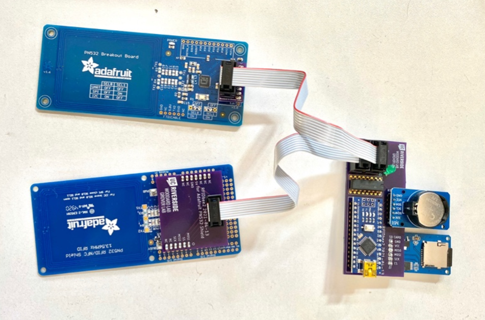

# RFIDbee

Code for "RFIDbee2" bee trackers by the Grover and Woodard Labs at the University of California, Riverside.

## Installing (or updating) software on RFIDbee2 trackers

1. Download and install the Arduino IDE for your operating system from [https://www.arduino.cc/en/software](https://www.arduino.cc/en/software)

1. Open the Arduino IDE.  Select *Tools > Manage Libraries*.  The "Library Manager" sidebar should appear.  In the "Filter your search" box, enter the name of each of these three libraries and search for and install them:
   * `Adafruit PN532` (by Adafruit)
   * `RTClib` (by Adafruit)
   * `SdFat` (by Bill Greiman)
If you are asked about installing library dependencies, select *INSTALL ALL*.

1. Download and unzip the RFIDbee2 software from this repository.

1. In the Finder (MacOS) or File Explorer (Windows), navigate to wherever you saved the RFIDbee2 software, and open the `RFIDbee2` subfolder.  Inside, double-click on the file `RFIDBEE2.ino`.  It should open in the Arduino IDE.

1. In the Arduino IDE, click the *Check* icon in the upper-left corner of the window.  After 

## Installing RFIDbee2 helper software on a Windows or MacOS computer

1. Download and install Python for your operating system from [https://www.python.org/downloads](https://www.python.org/downloads).  If you see an option similar to *"add python to PATH"* while installing, make sure that the is *checked*.
2. Clone the GitHub repo
4. In the terminal, type `pip install pyserial`

## Setting the real-time clock on an RFIDbee2 reader

1. Make sure you've already installed the RFIDbee2 helper software on your PC or Mac as described above.
3. Open Terminal (MacOS) or Windows PowerShell (Windows)
1. `cd` to cloned repo and type `python3 clocksetter`
